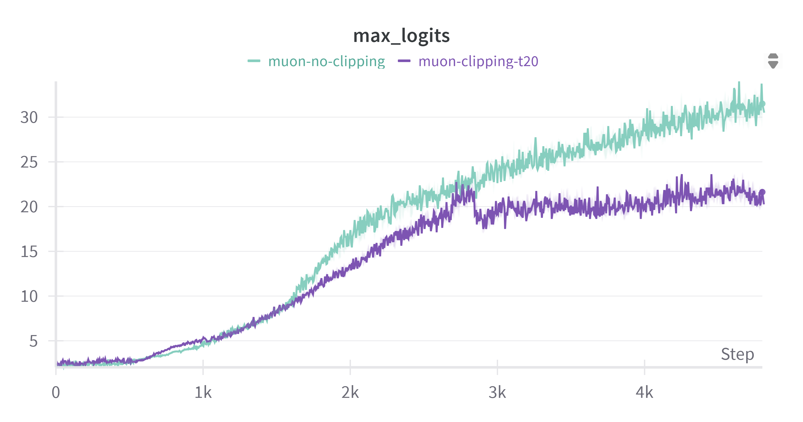

# Muon Optimizer 2.0

This repository presents an implementation of the Muon optimizer, enhanced with the QK-Clipping technique introduced in Kimi K2 and better newton-shulz orthogonalization.

## Key Features

- **QK-Clipping**: Introduces a mechanism to stabilize training by clipping attention logits for each head.
- **Esasy to use**: Designed to integrate seamlessly with existing transformer and pytorch architectures. Designed to be used as a regular pytorch optimizer.
- **Scalability**: Optimized for large-scale training scenarios and implemented for DDP training.

## QK-Clipping Explained

QK-Clipping is a technique that addresses the issue of exploding attention logits in transformer models. By rescaling the query and key matrices during training, QK-Clipping ensures that the attention scores remain within a stable range, preventing instability and promoting smoother convergence. This method was instrumental in the pre-training of Kimi K2 on 15.5 trillion tokens without any loss spikes.
The clipping is applied per heads.

For more details, refer to the following resources:

- [Kimi K2: Open Agentic Intelligence (arXiv)](https://arxiv.org/abs/2507.20534)

## How to use

Here's a basic example:

```python
from muon_clip import MuonClip, MuonConfig
from transformers import AutoConfig

# model config can also be a dic with at least num_key_value_heads,num_attention_heads and head_dim keys
model_config = AutoConfig.from_pretrained("{hf_model}")

muon_config = MuonConfig(
    muon_lr=5e-4,
    muon_momentum=0.95,
    muon_decay=0.0,
    
    enable_clipping=True,
    clipping_threshold=20.0,
    clipping_alpha=0.5,

    adam_lr=5e-4,
    adam_betas=(0.9, 0.95),
    adam_decay=0.0,
    adam_eps=1e-10
)

optimizer = MuonClip(model, model_config, muon_config)

model.train() #You must call model.train() after defining the optimizer so that hooks are registered correctly.

```

## Demo
Below a training test with and without clipping.
Notice how the logits are clipped when reaching clipping_threshold.


## Installation

To install muon-clip just use:

```bash
pip install git+https://github.com/GAD-cell/muon-clip.git@main
```

## Coming soon

-Currently working on an improved version of newton-shulz orthogonalization based on [Accelerating Newton-Shulz Iteration](https://arxiv.org/pdf/2506.10935v1) paper \
Experimental branch : newton-shulz-v2 with first results below : \


-"Zero stage 1" like optimization based on [distributed muon](https://arxiv.org/html/2502.16982v1)\
-Notebooks for training and distributed training with MuonClip